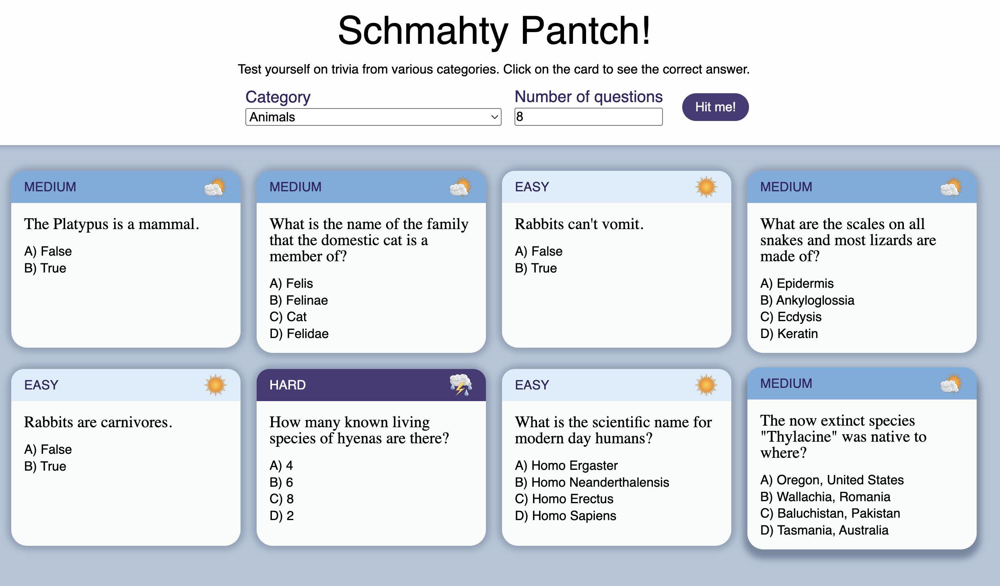
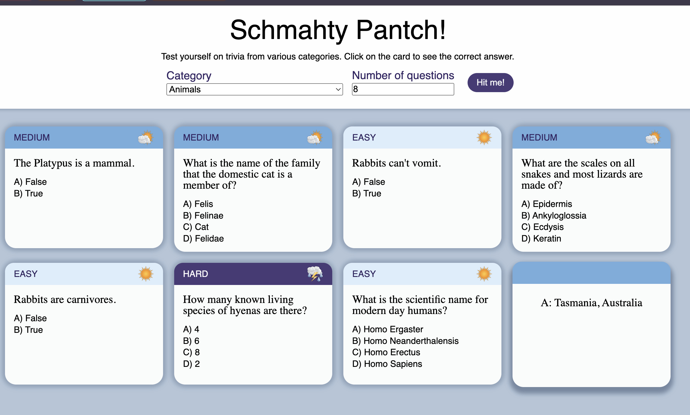

# Trivia App

## What?
A basic trivia app that pulls data from [The Open Trivia Database]('https://opentdb.com/') and renders flashcards with questions, answer options, and then the answer on the backside. Cards are styled depending on the difficulty level. I chose a weather theme because I've been missing rain here in Texas.

## Why?
I have not used Axios in a while and I missed it! I love playing around with free databases out there. I don't always know what I'll make, but I just love a good res.data to mess with. 

## How
- React, Axios for the tech
- weather color inspo from [Dribbble]('https://dribbble.com/shots/23852765-Fun-Weather-App')
- weather icons from [Pixabay]('https://pixabay.com/users/theujulala-59978/') 

--- 
vite mumbo jumbo
This template provides a minimal setup to get React working in Vite with HMR and some ESLint rules.

Currently, two official plugins are available:

- [@vitejs/plugin-react](https://github.com/vitejs/vite-plugin-react/blob/main/packages/plugin-react) uses [Babel](https://babeljs.io/) for Fast Refresh
- [@vitejs/plugin-react-swc](https://github.com/vitejs/vite-plugin-react/blob/main/packages/plugin-react-swc) uses [SWC](https://swc.rs/) for Fast Refresh

## Expanding the ESLint configuration

If you are developing a production application, we recommend using TypeScript with type-aware lint rules enabled. Check out the [TS template](https://github.com/vitejs/vite/tree/main/packages/create-vite/template-react-ts) for information on how to integrate TypeScript and [`typescript-eslint`](https://typescript-eslint.io) in your project.
